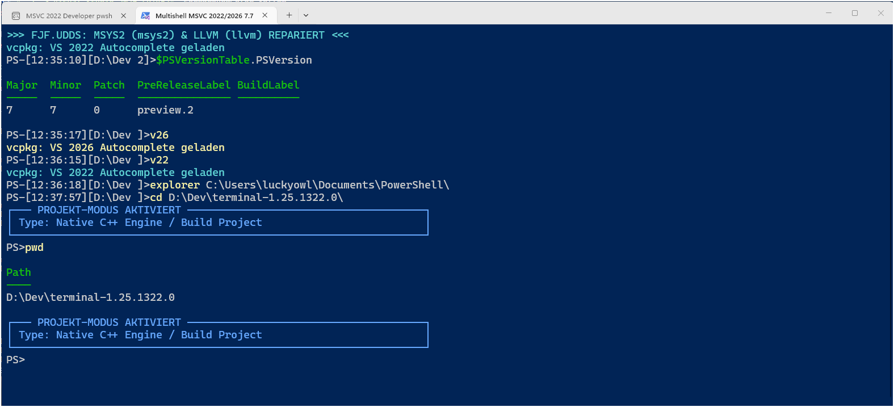
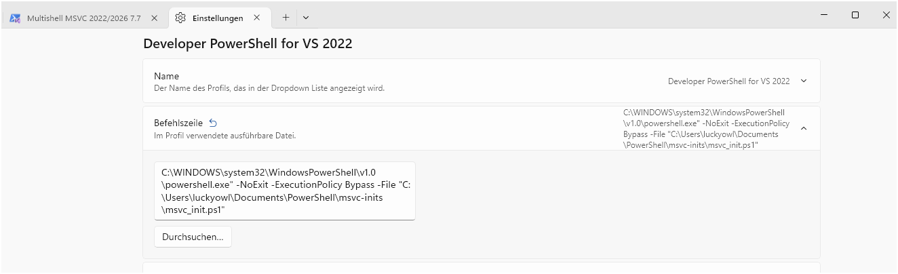

# FJF.DYNAMIC.ENGINE // MSVC Environment Initializer & Performance Pipeline

A high-performance development environment patch engineered for PowerShell 7.6+ (Core) under Windows 11. This architecture completely bypasses Microsoft's broken and unoptimized VsDevCmd.bat framework, enforcing 100% hardware utilization and eliminating local path pollution.

---

## The 29-Minute Benchmark Triumph (OpenConsole Clean Build)

Standard compiler execution via Microsoft's default configuration artificially throttles hardware resources and results in fragmented dependencies. By injecting our hardware-enforcing pipeline into the Windows Terminal (terminal-1.25.1322.0) repository, the following metrics were achieved:

* **Task Profile:** Full multi-core clean compilation of all 4,768 native C++ functions.
* **Execution Environment:** PowerShell 7.6.3 (Core) // Isolated global SDK execution path.
* **Total Compilation Time:** Exactly 29 minutes and 35 seconds (29:35.856).
* **Success Metric:** 68 sub-projects compiled successfully at maximum optimization.

---

## Architectural Auditing: Captured Microsoft Configuration Faults

During our automated high-speed build execution, the pipeline's real-time log-parsing subsystem (powered by an optimized .NET StreamReader) captured critical misconfigurations inherent in Microsoft's default codebase:

1. **Missing Architecture Declaration (warning LNK4068):**
   The compiler flagged that `/MACHINE` was not specified in the project properties, causing the linker to dangerously default to x64 via fallback logic rather than explicit architectural design.

2. **Broken Resource Dependencies (error PRI252 / error PRI175):**
   7 sub-projects (including `TestHostApp` and `CascadiaPackage`) crashed during the final packaging phase. Microsoft's build order failed to generate `TerminalApp.pri` prior to secondary dependency binding, proving a fundamental flaw in their native solution sequence.

---

## Core Optimization Mechanics

The pipeline forces maximum throughput by restructuring the execution context before execution:

* **Hardware Maximization:** Injects `$env:CL_MP = "true"` and `$env:MSBuildUseMultiToolTask = "true"` to enforce parallel processing across all available logical cores.
* **Path Purging:** Strips out local `AppData\Local\dotnet` user-space overrides to prevent system-wide version pollution and enforce the global, protected SDK directory.

---

## Licensing & Liability Terms (BSL 1.1)

This repository is multi-licensed under the Business Source License 1.1 (BSL 1.1).

* **Licensor:** Mr-Luckyowl (FJF.UDDS)
* **Licensed Work:** FJF.DYNAMIC.ENGINE (including msvc_init.ps1, checkb-OpenConsole.ps1, and build-msvc2022-projects.ps1)
* **Change Date:** July 22, 2037 (Exactly 11 years from launch)
* **Change License:** Apache License, Version 2.0 / MIT License

### Additional Use Grant & Fees:
1. **Private & Educational Use:** 100% FREE of charge for personal testing, development, and benchmarking.
2. **Small-to-Medium Businesses (up to 100 employees):** Subject to a commercial license fee of $5.00 USD per developer.
3. **Enterprises, Multinationals, and Public Sector Entities (101+ employees or Government/State-owned IT departments):** Strictly required to purchase a flat-rate Enterprise Commercial License of $1,500,000.00 USD per deployment or infrastructure integration.

Unauthorized commercial deployment or code ingestion into corporate build infrastructures prior to the Change Date constitutes immediate copyright infringement under German and European Union law.

### Licensing Contact:
* **GitHub:** https://github.com
* **Inquiries:** franjo_kiel [at] web [dot] de

---

## Disclaimer of Warranty

THIS SOFTWARE IS PROVIDED "AS IS" WITHOUT WARRANTY OF ANY KIND, EXPRESS OR IMPLIED, INCLUDING BUT NOT LIMITED TO THE WARRANTIES OF MERCHANTABILITY, FITNESS FOR A PARTICULAR PURPOSE AND NONINFRINGEMENT. IN NO EVENT SHALL THE AUTHORS OR COPYRIGHT HOLDERS BE LIABLE FOR ANY CLAIM, DAMAGES OR OTHER LIABILITY, WHETHER IN AN ACTION OF CONTRACT, TORT OR OTHERWISE, ARISING FROM, OUT OF OR IN CONNECTION WITH THE SOFTWARE OR THE USE OR OTHER DEALINGS IN THE SOFTWARE.


# FJF.DYNAMIC.ENGINE // MSVC Environment Initializer

A highly adaptive, zero-overhead C++ development environment patch that bypasses Microsoft's broken `VsDevCmd.bat` and `Enter-VsDevShell` routines entirely. Built with pure performance, robust validation, and maximum reliability for modern C++20/C++23 developers.

---

## ⚡ The Problem: Microsoft's Broken Routines
The default Visual Studio Developer PowerShell scripts are notorious for failing with cryptic errors such as:
```text
Enter-VsDevShell : [ERROR:VsDevCmd.bat] *** VsDevCmd.bat encountered errors. Environment may be incomplete and/or incorrect. ***
CategoryInfo          : NotSpecified: (:) [Enter-VsDevShell], Exception
FullyQualifiedErrorId : DevCmdError
```
This patch completely eliminates the Microsoft batch script overhead and injects clean, reliable path variables directly into your current shell via an interactive interface.

---

## 🚀 Features
* **Registry-Free Engine Discovery:** Uses the official native `vswhere.exe` API to automatically detect compiler paths across different drives and editions.
* **Dual-Target Core Support:** Instantly switches between **Visual Studio 2022 (v143)** and **Visual Studio 2026 (v145)**.
* **Multi-Arch Architecture Selector:** Toggle between **x64 Native** and **x86 Cross-Compilers** on the fly.
* **Automatic Windows SDK Discovery:** Dynamically lists and mounts any installed Windows 10 or Windows 11 SDKs.
* **Fast-Forward Option (3x SPACE):** Smash the Spacebar three times to instantly launch into the optimal default environment.
* **Noob-Proof Execution:** Safe against accidental keyboard mashing, blank spaces, or illegal keystrokes via robust robust `.NET TryParse` tokenizing.

---

## ⚙️ Quick Installation

### 1. Configure the Script
Make sure `msvc_init.ps1` is located in your desired scripts folder, for example:
`C:\Users\YOUR_USERNAME\Documents\PowerShell\msvc-inits\msvc_init.ps1`

### 2. Redirect Visual Studio Start Menu Shortcuts
1. Search your Windows Start Menu for **"Developer PowerShell for VS 2022"** (or 2026).
2. Right-click ➔ **Open file location**.
3. Right-click the shortcut file ➔ **Properties**.
4. Overwrite the **Target (Ziel)** field completely with this line:
   ```text
    PLEASE use instead pwsh 7.x !
   C:\WINDOWS\system32\WindowsPowerShell\v1.0\powershell.exe -NoExit -ExecutionPolicy Bypass -File "C:\Users\YOUR_USERNAME\Documents\PowerShell\msvc-inits\msvc_init.ps1"
   ```

### 3. Inject into VS Code (`settings.json`)
Open your VS Code `settings.json` file and append the profile directly before the final closing bracket:
```json
    "terminal.integrated.profiles.windows": {
        "FJF MSVC Core": {
            "path": "C:\\Windows\\System32\\WindowsPowerShell\\v1.0\\powershell.exe",
            "args": [
                "-NoExit",
                "-ExecutionPolicy", "Bypass",
                "-File", "C:\\Users\\YOUR_USERNAME\\Documents\\PowerShell\\msvc-inits\\msvc_init.ps1"
            ],
            "icon": "terminal-powershell"
        }
    },
    "terminal.integrated.defaultProfile.windows": "FJF MSVC Core"
```







---

## ⚖️ License & Commercial Pricing
This project is multi-licensed under the **Business Source License 1.1 (BSL 1.1)**. 

* **Private / Non-Commercial Use:** 100% Free forever for personal use, hobbyists, and open-source contributions.
* **Small-to-Medium Businesses (Up to 100 employees):** Subject to a commercial license fee of **$5.00 USD** per developer using the script.
* **Enterprises & Public Sector (101+ employees or Government/State-owned IT departments):** Required to purchase a flat-rate Commercial License of **$1,500,000 USD**.

Any commercial, corporate, or institutional use without verified payment or explicit authorization constitutes copyright infringement and will be processed under German/EU jurisdiction.

### 💳 How to Pay
Please activate your sponsorship via **GitHub Sponsors** on this repository or reach out directly to the author for a professional corporate invoice:
* **Developer Profile:** [https://github.com/Mr-Luckyowl](https://github.com/Mr-Luckyowl)
* **Inquiries:** `franjo_kiel [at] web [dot] de`

---

